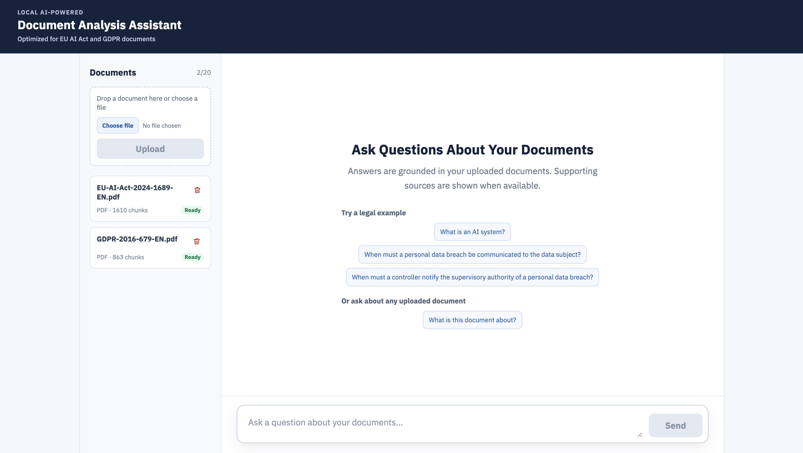
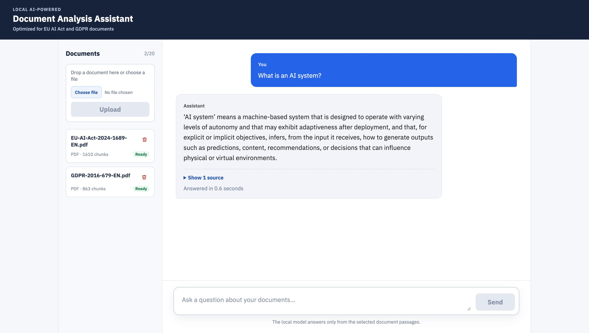
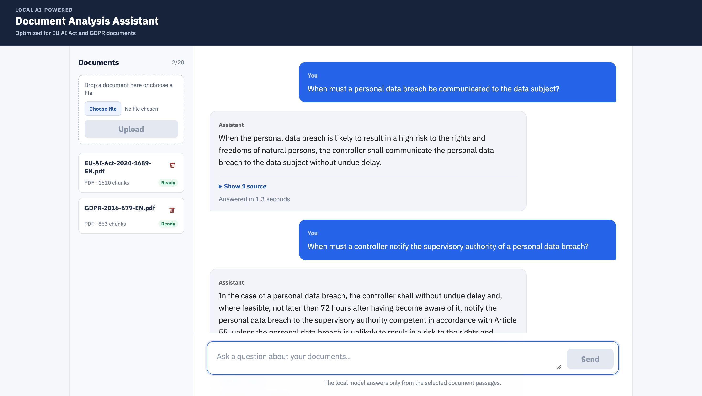
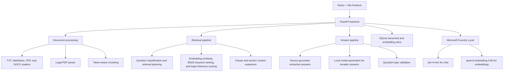

# Local AI-Powered Document Analysis Assistant

A local document question-answering application built with Microsoft Foundry Local. It answers questions from uploaded documents, shows the source excerpts used for each answer, and is optimized for structured legal material such as the EU AI Act and the GDPR.

The application also supports general TXT, Markdown, PDF, and DOCX documents. While optimized and tested most extensively for the EU AI Act and GDPR, it maintains a general-purpose document workflow.

> Developed for the Microsoft AI Innovators Summer Internship Program.

## Overview

- Upload up to 20 TXT, Markdown, PDF, or DOCX documents.
- Store document text and embeddings locally in SQLite.
- Retrieve relevant text segments before generating an answer.
- Combine semantic embedding similarity with BM25 keyword ranking for retrieval.
- Display the source document, legal reference, page, section, and retrieval relevance for each response.
- Use legal-aware parsing for structured regulations, including articles, paragraphs, points, and subpoints.
- Handle definitions, conditions, obligations, lists, procedures, summaries, and cross-document comparisons.
- Return direct source-based answers for clear legal definitions, conditions, and complete lists, avoiding a local chat-model call when synthesis is unnecessary.
- Use the local chat model for broader legal and general-document questions that need a concise synthesis.

The retrieval pipeline is specifically optimized for two documents: **Regulation (EU) 2024/1689** (the EU AI Act) and **Regulation (EU) 2016/679** (the GDPR). For legal questions, the application identifies the question type and selects the relevant legal scope before answering, and can expand a selected clause with its parent context, related conditions, exceptions, and list items when needed.

## Screenshots





## Technology Stack

| Area | Technology |
| --- | --- |
| Frontend | React, TypeScript, Vite |
| Backend | FastAPI, Uvicorn |
| Local AI runtime | Microsoft Foundry Local |
| Chat model | `phi-4-mini` |
| Embedding model | `qwen3-embedding-0.6b` |
| Retrieval | Semantic embeddings, BM25 keyword ranking, legal-aware scoring |
| Storage | SQLite |
| Document processing | PyMuPDF, python-docx, Hugging Face Tokenizers |

## System Architecture & RAG Pipeline

### Architecture



### RAG Approach

This application uses retrieval-augmented generation (RAG): it retrieves relevant text segments from uploaded documents before producing an answer, instead of relying on the chat model's general knowledge.

1. A document is read, structured into chunks, embedded, and stored locally.
2. A question is classified to determine its expected answer type and retrieval scope.
3. Hybrid retrieval combines embedding similarity with BM25 keyword ranking and legal-aware scoring.
4. The selected context can be expanded with parent clauses, related list items, conditions, or exceptions.
5. Clear legal definitions, conditions, and complete lists are returned directly from the source context. Broader questions are answered by the local chat model using only the retrieved context.
6. The answer is validated against the question type, and the supporting sources are returned to the interface.

## Technical Reference

### Project Structure

```text
.
├── backend/
│   ├── app/
│   │   ├── main.py                  FastAPI application entry point
│   │   ├── database.py              SQLite initialization
│   │   ├── routers/                 Chat and document API endpoints
│   │   ├── repositories/            SQLite data access
│   │   └── services/
│   │       ├── document_processing/ Document reading, parsing, chunking, and ingestion
│   │       ├── retrieval/           Question planning, scoring, and context expansion
│   │       └── rag/                 Answer generation and validation
│   └── tests/                       Core RAG and legal-retrieval tests
│
├── frontend/
│   └── src/                         React interface and API client
│
├── docs/                            README screenshots
├── README.md
└── .gitignore
```

At runtime, the backend creates `backend/data/` for the local SQLite database and uploaded documents. This folder is excluded from version control.

### Supported Documents and Storage

| Item | Details |
| --- | --- |
| File types | `.txt`, `.md`, `.pdf`, `.docx` |
| Maximum file size | 10 MB per document |
| Maximum document count | 20 documents |
| Metadata | Filename, file type, size, upload status, chunk count, and timestamps |
| Local database | `backend/data/rag.db` |
| Uploaded files | `backend/data/documents/` |

The database and uploaded files are intentionally excluded from version control.

### API Overview

| Method | Endpoint | Purpose |
| --- | --- | --- |
| `GET` | `/api/health` | Check backend and Foundry Local availability |
| `GET` | `/api/documents` | List uploaded documents |
| `POST` | `/api/documents` | Upload and index a document |
| `DELETE` | `/api/documents/{document_id}` | Delete an indexed document |
| `POST` | `/api/chat` | Ask a document-grounded question |

## Run Locally

### Requirements

- Python 3.12 or later
- Node.js LTS and npm
- [uv](https://docs.astral.sh/uv/)
- Microsoft Foundry Local available on the machine

> **Note:** The backend downloads and loads the configured Foundry Local models on first use. The first request can therefore take noticeably longer than later requests.

### Installation and Execution

Clone the repository and open two terminals.

```bash
git clone https://github.com/ahmetmelihcalis/Local-AI-Powered-Document-Analysis-Assistant.git
cd Local-AI-Powered-Document-Analysis-Assistant
```

Start the backend:

```bash
cd backend
uv sync
uv run uvicorn app.main:app --reload
```

Start the frontend in a second terminal:

```bash
cd frontend
npm install
npm run dev
```

Open the URL printed by Vite, usually `http://localhost:5173`.

## Limitations

- Answers are limited to the information retrieved from uploaded documents.
- The application answers in English.
- General-document quality depends on document extraction quality and the clarity of the question.
- Legal retrieval is optimized for the EU AI Act and GDPR; it is not legal advice.
- The application is intended for local, single-user use and does not include authentication or multi-user collaboration.
- Microsoft Foundry Local must be available for model-backed answers and embedding generation.
